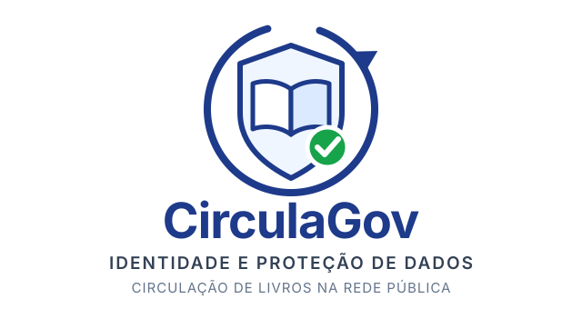
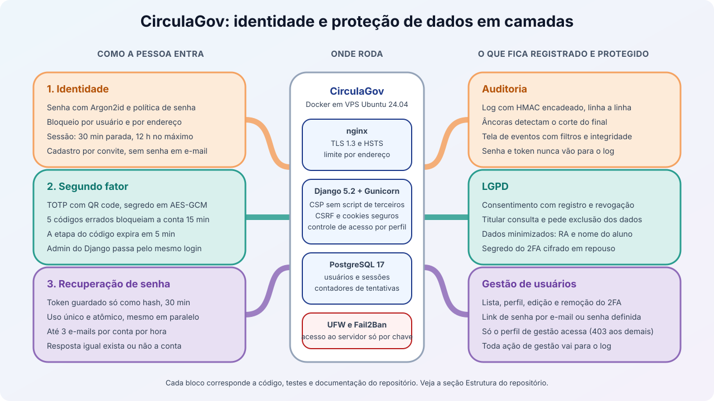

<p align="center">
  
</p>

<p align="center">
  <a href="https://github.com/Grupo-Opus-Dev/circulagov/actions/workflows/testes.yml"></a>
  <a href="https://github.com/Grupo-Opus-Dev/circulagov/releases"></a>
  <a href="https://circulagov.nossoprojeto.app.br"></a>
  
</p>

<p align="center">
  
  
  
  
  
</p>

<p align="center">
  
  
  
  
  
  
</p>

O **CirculaGov** é uma plataforma de identidade e proteção de dados pessoais
para um programa de circulação de livros entre escolas da rede pública. Ele
reúne autenticação com segundo fator, recuperação de senha, criptografia,
conformidade com a LGPD e auditoria com log à prova de adulteração, e está no ar
em [circulagov.nossoprojeto.app.br](https://circulagov.nossoprojeto.app.br).

Trabalho da disciplina **Políticas de Segurança da Informação**.

<p align="center">
  
</p>

## 📚 Comece por aqui

| Documento | Para quê |
|---|---|
| [docs/GUIA_AVALIACAO.md](docs/GUIA_AVALIACAO.md) | **roteiro para testar cada item do checklist no sistema em produção** |
| [docs/VISAO_GERAL.md](docs/VISAO_GERAL.md) | o que o sistema faz, o que não faz, e como rodar |
| [docs/ARQUITETURA.md](docs/ARQUITETURA.md) | diagramas de camadas, apps, requisição e chaves |
| [docs/ANALISE_RISCOS.md](docs/ANALISE_RISCOS.md) | ativos, ameaças, contramedidas e risco residual |
| [docs/TESTES_SEGURANCA.md](docs/TESTES_SEGURANCA.md) | cada ameaça ligada ao teste que a comprova |
| [docs/DEPLOY.md](docs/DEPLOY.md) | como o sistema foi colocado no ar e como atualizar |

## 🎯 Escopo entregue

A disciplina avalia segurança da informação. Foi nessa camada que o projeto
aprofundou: autenticação, recuperação de senha, criptografia, conformidade com
a LGPD e auditoria.

O módulo de acervo (catálogo, empréstimo, devolução, licitações e estoque) não
foi implementado. O documento [docs/README.md](docs/README.md), escrito no
início do projeto, descreve o produto completo que foi imaginado. Para o que
existe hoje, veja a [visão geral](docs/VISAO_GERAL.md).

## 📁 Estrutura do repositório

```
.
├── alunos/               # Cadastro mínimo do aluno (RA e nome)
├── auditoria/            # Log com HMAC, âncoras, telas de integridade e de eventos
├── config/               # Configurações do Django (settings, urls, wsgi)
├── consentimento/        # Consentimento da LGPD, com registro e revogação
├── deploy/nginx/         # Limites de requisição do nginx e o teste que os confere
├── direitos_titular/     # Consulta e exclusão dos dados pelo titular
├── docs/                 # Documentação técnico-científica e evidências
├── dois_fatores/         # TOTP, QR code, cifragem do segredo e trava de tentativas
├── recuperacao_senha/    # Token de uso único, e-mail e limite por conta
├── static/               # CSS do Tailwind e JavaScript próprios, sem CDN
├── templates/            # Telas em Django Templates
├── usuarios/             # Login, gestão de usuários, bloqueio e admin sobre o login da aplicação
├── .github/workflows/    # CI: testes no PostgreSQL e conferência do nginx
├── Dockerfile            # Imagem da aplicação
├── docker-compose.yml    # Aplicação e banco, portas só em 127.0.0.1
└── entrypoint.sh         # Migra, coleta os estáticos e sobe o Gunicorn
```

## 🧩 Componentes principais

- **`usuarios/`**: o login (`LoginComDoisFatoresView`) só chama `login()` depois
  do código do segundo fator. `seguranca.py` e `contadores.py` fazem o bloqueio
  por usuário e endereço, com contadores atômicos no banco. `views_gestao.py` e
  `forms.py` cuidam da lista, do perfil e do cadastro por convite. `admin_site.py`
  faz o `/admin/` aceitar só a sessão do login da aplicação.
- **`dois_fatores/`**: `cripto.py` cifra o segredo TOTP com AES-GCM,
  `qrcode_totp.py` gera o QR code no servidor e `limite.py` bloqueia a conta
  depois de 5 códigos errados.
- **`recuperacao_senha/`**: o token é guardado como hash, vale 30 minutos e é
  consumido por um `UPDATE` condicional, então não serve duas vezes nem em
  pedidos simultâneos.
- **`consentimento/` e `direitos_titular/`**: base legal, registro e revogação do
  consentimento, e os direitos do titular previstos na LGPD.
- **`auditoria/`**: `integridade.py` assina e encadeia cada linha do log. As
  âncoras (`emitir_ancora`) detectam o corte do final do arquivo. A tela
  `/auditoria/eventos/` lista os eventos e mostra se a cadeia está íntegra.
- **`deploy/nginx/`**: limites de requisição por endereço para login, 2FA e
  recuperação, com teste automatizado contra um nginx de verdade.

## 🛡️ Correções recentes (03/10/2026)

Uma revisão de segurança externa apontou seis pontos, todos corrigidos e
publicados:

- **Admin do Django**: o login próprio dele dispensava o segundo fator e o
  bloqueio. Agora `/admin/login/` só redireciona para o login da aplicação.
- **Bloqueio de login**: tentativas durante o bloqueio renovavam o prazo e
  trancavam a conta para sempre. Passou a valer por usuário e endereço, com teto
  por conta.
- **Segundo fator**: 5 códigos errados bloqueiam a conta por 15 minutos, e a
  etapa do código expira em 5 minutos.
- **Recuperação de senha**: o link de uso único agora é atômico, e há no máximo
  3 e-mails por conta por hora.
- **Tailwind e CSP**: o CSS saiu de um CDN de terceiros e o site envia
  `Content-Security-Policy` sem `unsafe-inline`.
- **Âncoras do log**: o corte do final do log passou a ser detectável.

Depois da revisão, os contadores de tentativas deixaram o cache em banco do
Django e foram para uma tabela própria, porque o incremento do cache não é
atômico e tentativas simultâneas podiam ser contadas a menos. Os testes de cada
ponto estão em [docs/TESTES_SEGURANCA.md](docs/TESTES_SEGURANCA.md), e o que ainda
não está resolvido, como o agendamento das âncoras e a obrigatoriedade do 2FA para
contas de gestão, está em [docs/ANALISE_RISCOS.md](docs/ANALISE_RISCOS.md).

## ✅ Onde está cada requisito do checklist

| Bloco | Código | Documentação |
|---|---|---|
| 1. Autenticação e credenciais | `usuarios/`, `dois_fatores/` | [FLUXO_AUTENTICACAO.md](docs/FLUXO_AUTENTICACAO.md), [GESTAO_CREDENCIAIS.md](docs/GESTAO_CREDENCIAIS.md), [JUSTIFICATIVAS_TECNICAS.md](docs/JUSTIFICATIVAS_TECNICAS.md) |
| 2. Recuperação de senha | `recuperacao_senha/` | [FLUXO_RECUPERACAO_SENHA.md](docs/FLUXO_RECUPERACAO_SENHA.md), [EVIDENCIAS_RECUPERACAO_SENHA.md](docs/EVIDENCIAS_RECUPERACAO_SENHA.md) |
| 3. Criptografia e comunicação | `dois_fatores/cripto.py`, `config/settings.py` | [ESTRATEGIA_CRIPTOGRAFIA.md](docs/ESTRATEGIA_CRIPTOGRAFIA.md), [EVIDENCIA_TLS.md](docs/EVIDENCIA_TLS.md) |
| 4. LGPD | `consentimento/`, `direitos_titular/` | [DADOS_PESSOAIS.md](docs/DADOS_PESSOAIS.md), [FLUXO_DIREITOS_TITULAR.md](docs/FLUXO_DIREITOS_TITULAR.md) |
| 5. Auditoria e logs | `auditoria/` | [INTEGRIDADE_LOGS.md](docs/INTEGRIDADE_LOGS.md), [ANALISE_LOGS.md](docs/ANALISE_LOGS.md), [LOGS_AUTENTICACAO.md](docs/LOGS_AUTENTICACAO.md) |
| 6. Documentação técnico-científica | `docs/` | [VISAO_GERAL.md](docs/VISAO_GERAL.md), [ARQUITETURA.md](docs/ARQUITETURA.md), [FLUXOS.md](docs/FLUXOS.md), [ANALISE_RISCOS.md](docs/ANALISE_RISCOS.md), [TESTES_SEGURANCA.md](docs/TESTES_SEGURANCA.md), [REFERENCIAS.md](docs/REFERENCIAS.md) |

Evidências de funcionamento em [docs/evidencias/](docs/evidencias).

## 🧰 Stack

Python 3.13, Django 5.2 LTS, PostgreSQL 17, Gunicorn, WhiteNoise, Django
Templates com Tailwind CSS 3.4 gerado e versionado em `static/css/`. Em produção:
Docker Compose, nginx no servidor com TLS 1.3 (Let's Encrypt), UFW e Fail2Ban.
Arquitetura monólito modular, padrão MVT.

## 🚀 Como rodar

```bash
python -m venv venv
venv\Scripts\activate
pip install -r requirements.txt
```

Copie `.env.example` para `.env` e preencha. As chaves de criptografia (2FA e
integridade do log) precisam ser geradas e precisam ser diferentes entre si:

```bash
python -c "import base64, os; print(base64.b64encode(os.urandom(32)).decode())"
```

```bash
python manage.py migrate
python manage.py createsuperuser
python manage.py runserver
```

Testes, verificação de integridade do log e emissão de uma âncora:

```bash
python manage.py test
python manage.py verificar_logs
python manage.py emitir_ancora
```

Os testes rodam sozinhos no GitHub Actions a cada Pull Request, e a `main` só
aceita merge com a checagem `testes` verde. O passo a passo para colocar no ar,
com Docker e nginx, está em [docs/DEPLOY.md](docs/DEPLOY.md).

## 👥 Equipe

| Integrante | GitHub |
|---|---|
| Everson Duarte de Souza | [@everson-duarte](https://github.com/everson-duarte) |
| Emanuel Victor | [@Manuzel](https://github.com/Manuzel) |
| Vitor Dias Santana | [@vitin2505](https://github.com/vitin2505) |
| Maycon Wendyl da Silva Pereira | [@wendylmaycon](https://github.com/wendylmaycon) |

## 📦 Entregas

As releases seguem as etapas da disciplina. Veja
[Releases](https://github.com/Grupo-Opus-Dev/circulagov/releases) e o
[quadro Kanban](https://github.com/orgs/Grupo-Opus-Dev/projects/1).
