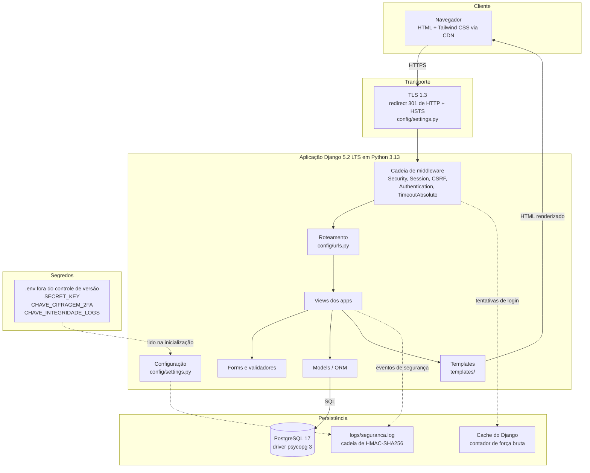
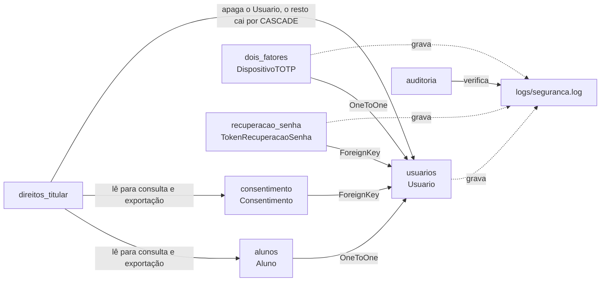
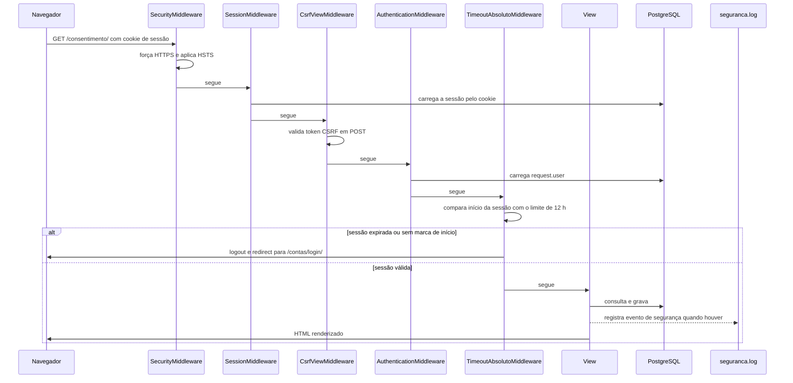
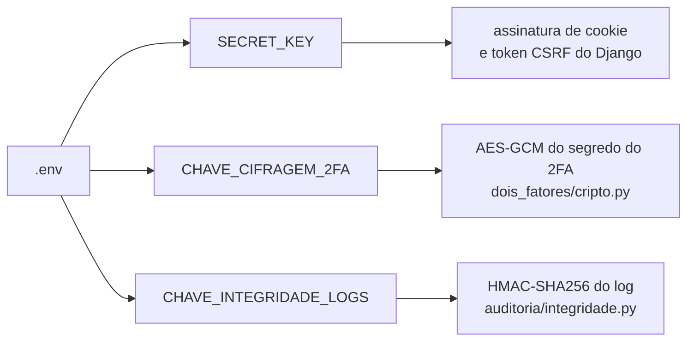

# Arquitetura do CirculaGov (Issue 6.2)

Este documento descreve como o sistema está montado por dentro: quais camadas
existem, por onde passa uma requisição, onde cada dado é guardado e por que as
escolhas foram feitas assim.

Os diagramas estão em Mermaid, que o GitHub renderiza direto na página. Quem
quiser conferir se o desenho bate com o código pode abrir os arquivos citados,
todos com caminho indicado.

Referências cruzadas:

- fluxos de negócio detalhados: [FLUXO_AUTENTICACAO.md](FLUXO_AUTENTICACAO.md),
  [FLUXO_RECUPERACAO_SENHA.md](FLUXO_RECUPERACAO_SENHA.md) e
  [FLUXO_DIREITOS_TITULAR.md](FLUXO_DIREITOS_TITULAR.md)
- decisões de segurança e o porquê de cada uma: [JUSTIFICATIVAS_TECNICAS.md](JUSTIFICATIVAS_TECNICAS.md)
- criptografia: [ESTRATEGIA_CRIPTOGRAFIA.md](ESTRATEGIA_CRIPTOGRAFIA.md)

---

## 1. Estilo arquitetural

O CirculaGov é um **monólito modular** em Django, seguindo o padrão **MVT**
(Model, View, Template), que é a variação do MVC usada pelo framework.

"Monólito" porque tudo roda em um único processo e um único banco. "Modular"
porque o código está separado em apps Django independentes, cada um com seus
próprios models, views, URLs e testes.

Por que não microsserviços:

- o time tem quatro pessoas e o prazo é de semanas, não de meses
- a superfície de ataque cresce com o número de serviços expostos em rede
- com um processo só, o controle de sessão e o log de segurança ficam
  centralizados, o que é justamente o que o projeto precisa demonstrar
- Django já entrega autenticação, ORM, CSRF e migrações prontos, e trocar isso
  por serviços separados custaria tempo sem ganho de segurança

---

## 2. Visão em camadas

As setas tracejadas são efeitos laterais: gravação de log, contagem de
tentativas e leitura de configuração. As setas cheias são o caminho normal da
requisição.

---

## 3. Apps e responsabilidades

Cada app resolve um bloco do checklist. Essa separação foi feita de propósito,
para que o avaliador consiga ligar requisito a pasta.

| App | Responsabilidade | Bloco do checklist | Model principal |
|---|---|---|---|
| `usuarios` | login, logout, sessão, força bruta, hash de senha | 1 | `Usuario` |
| `dois_fatores` | cadastro e verificação de TOTP | 1 | `DispositivoTOTP` |
| `recuperacao_senha` | token de redefinição por e-mail | 2 | `TokenRecuperacaoSenha` |
| `consentimento` | aceite e revogação por finalidade | 4 | `Consentimento` |
| `direitos_titular` | consulta, exportação e exclusão de dados | 4 | não tem model próprio |
| `alunos` | dado de domínio do aluno | 4 | `Aluno` |
| `auditoria` | integridade e análise do log | 5 | não tem model próprio |
| `config` | settings, URLs raiz, WSGI | transversal | não se aplica |

`direitos_titular` e `auditoria` não têm model porque operam sobre dados que já
existem: o primeiro lê e apaga registros dos outros apps, o segundo trabalha
sobre o arquivo de log.

### Dependências entre apps

`usuarios.Usuario` é o centro do modelo. Ele estende `AbstractUser` e está
declarado como `AUTH_USER_MODEL` em `config/settings.py`, então todo o resto do
Django aponta para ele.

---

## 4. Caminho de uma requisição autenticada

A ordem do middleware importa para a segurança: o CSRF precisa rodar antes da
view, e o timeout de sessão precisa rodar depois da autenticação, senão não há
usuário para checar.

O `TimeoutAbsolutoMiddleware` (`usuarios/middleware.py`) é fail-closed: se a
marca de início da sessão não existir, ele desloga em vez de deixar passar.

---

## 5. Onde cada dado é guardado

| Dado | Onde fica | Como é protegido | Código |
|---|---|---|---|
| Senha | coluna `password` de `usuarios_usuario` | hash Argon2id com salt único por usuário | `usuarios/hashers.py` |
| Segredo do 2FA | coluna `segredo_cifrado` de `dois_fatores_dispositivototp` | AES-GCM em repouso | `dois_fatores/cripto.py` |
| Token de recuperação | coluna `token_hash` | só o SHA-256 é gravado, o token em claro nunca toca o banco | `recuperacao_senha/models.py` |
| Consentimento | tabela `consentimento_consentimento` | finalidade, versão dos termos e data de aceite | `consentimento/models.py` |
| Dados do aluno | tabela `alunos_aluno` | RA e nome, minimizados | `alunos/models.py` |
| Sessão | tabela `django_session` | cookie HttpOnly, e Secure quando `DEBUG` é falso | `config/settings.py` |
| Eventos de segurança | `logs/seguranca.log`, fora do git | cada linha assinada e encadeada com a anterior por HMAC-SHA256 | `auditoria/integridade.py` |
| Tentativas de login | cache do Django, em memória | contador com janela de 15 min | `usuarios/seguranca.py` |
| Chaves | `.env`, fora do git | nunca entram no código nem no banco | `config/settings.py` |

---

## 6. Separação de chaves

O projeto usa três chaves distintas, cada uma com uma finalidade única. Se uma
vazar, as outras continuam valendo.

O `.env` está no `.gitignore`. O `.env.example` fica versionado só com os nomes
das variáveis e o comando para gerar as chaves, sem valor nenhum.

---

## 7. Log de segurança

Os loggers próprios do projeto são todos filhos de `seguranca`, o que faz cada
evento cair automaticamente no handler que assina as linhas.

| Logger | Onde é usado | O que registra |
|---|---|---|
| `seguranca.autenticacao` | `usuarios/views.py`, `usuarios/signals.py` | login, logout, falha e bloqueio |
| `seguranca.dois_fatores` | `dois_fatores/views.py`, `dois_fatores/models.py` | ativação e verificação do TOTP |
| `seguranca.recuperacao_senha` | `recuperacao_senha/views.py` | solicitação, sucesso e falha |

O handler `HandlerLogIntegro` está declarado no `LOGGING` de
`config/settings.py` e implementado em `auditoria/integridade.py`. Ele
acrescenta ` | mac=<hex>` no fim de cada linha, onde o MAC cobre o MAC anterior
mais o texto da linha atual. Detalhes em [INTEGRIDADE_LOGS.md](INTEGRIDADE_LOGS.md).

---

## 8. Stack e versões

| Camada | Tecnologia | Versão |
|---|---|---|
| Linguagem | Python | 3.13.4 |
| Framework | Django | 5.2.17 LTS |
| Banco | PostgreSQL | 17.4 |
| Driver | psycopg | 3.3.4 |
| Hash de senha | argon2-cffi | 25.1.0 |
| Criptografia | cryptography | 50.0.1 |
| TOTP | PyOTP | 2.10.0 |
| Configuração | django-environ | 0.14.0 |
| Interface | Django Templates + Tailwind CSS via CDN | não se aplica |

As versões vêm de `requirements.txt`. Django 5.2 foi escolhido por ser LTS, com
suporte estendido, o que evita trocar de versão no meio do projeto.

---

## 9. O que a arquitetura ainda não cobre

Registrado de propósito, para não dar a entender que o sistema está pronto para
produção:

- o cache de força bruta é o cache local em memória, então em mais de um
  processo cada um teria a própria contagem. Em produção isso pediria Redis.
- o e-mail de recuperação usa o backend de console, que escreve no terminal em
  vez de enviar de verdade.
- o log é arquivo local. A cadeia de HMAC detecta alteração, mas quem tiver
  acesso de escrita ao servidor ainda pode apagar o arquivo inteiro. Proteger
  contra isso exigiria enviar as linhas para fora da máquina.
- não há rotina de expurgo por tempo de retenção.
